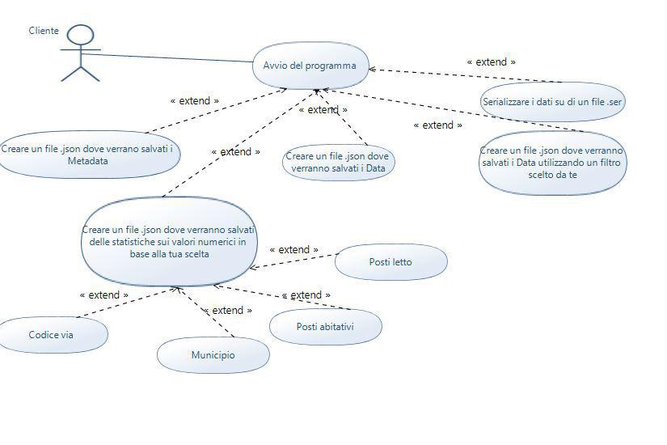
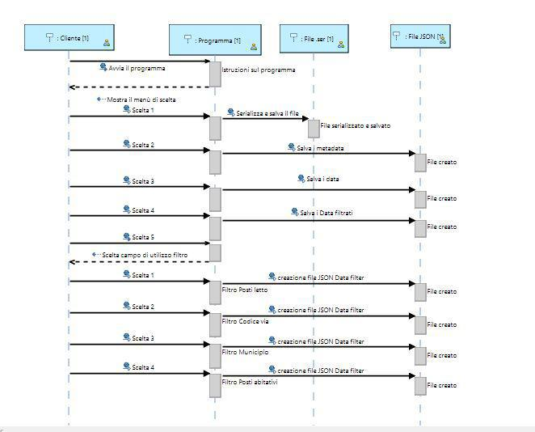

Progetto Programmazione!
===================

Repository del progetto di programmazione a oggetti.

Il dataset riporta le case vacanza di Milano specificandone il numero di posti letto, dei posti abitativi, l'ubicazione e la zona di dove si trovano.Sono definite case e appartamenti per vacanze (CAV) le strutture ricettive gestite in modo unitario e organizzate per fornire alloggio ed eventualmente servizi complementari in unità abitative o parti di esse, con destinazione residenziale , composte da uno o più locali arredati e dotati di servizi igienici e di cucina e collocate in un unico complesso o in più complessi immobiliari.
Le case e appartamenti per vacanze possono essere gestiti: -In forma imprenditoriale; -In forma non imprenditoriale da coloro che hanno la disponibilità fino a un massimo di tre unità abitative e svolgono l’attività in modo occasionale.

Le case e appartamenti per vacanze mantengono la destinazione urbanistica residenziale e devono possedere i requisiti igienico sanitari ed edilizi previsti per i locali di civile abitazione.

----------

Documents
-------------

## Use case Diagram

## Class Diagram

## Sequence Diagram

